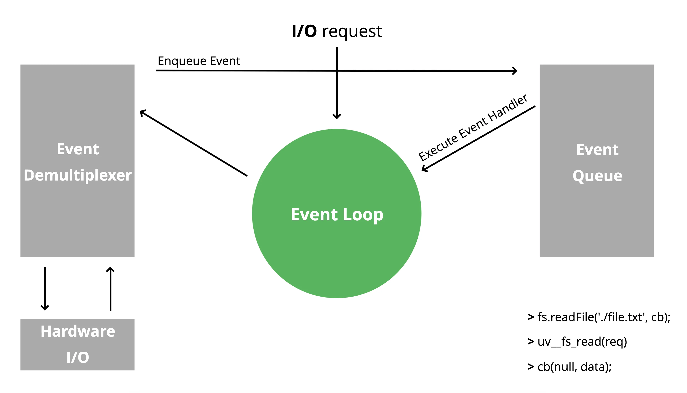
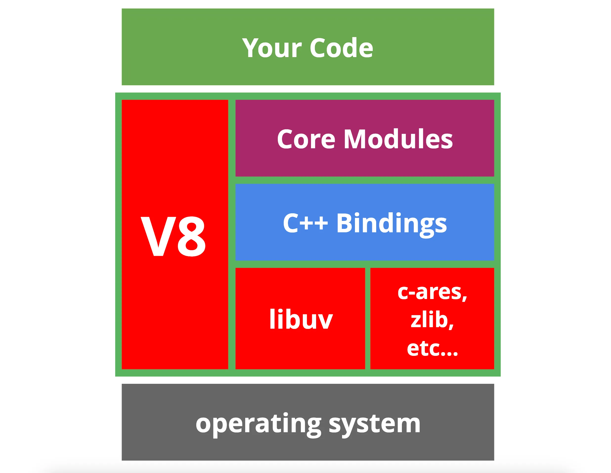
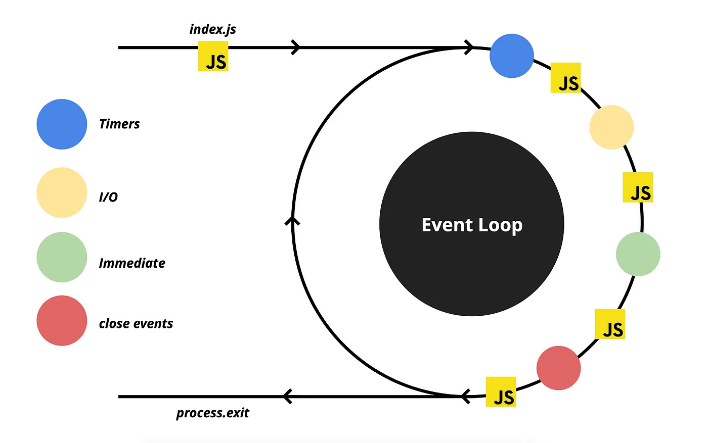
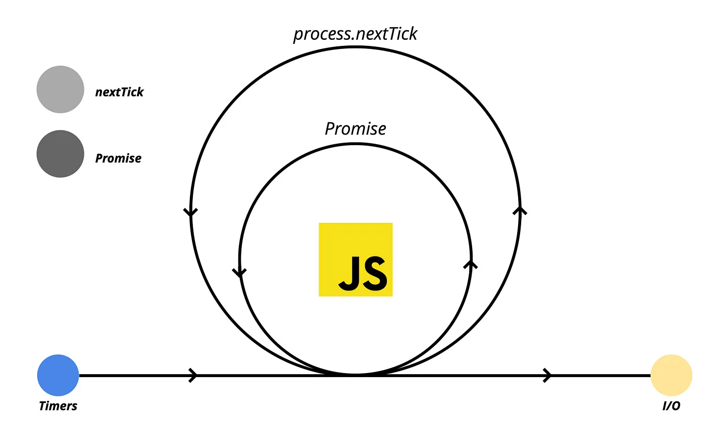
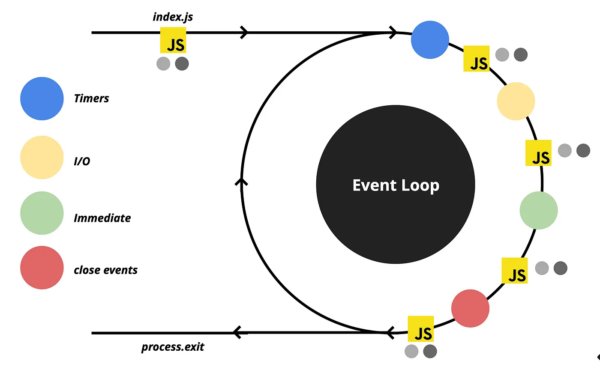
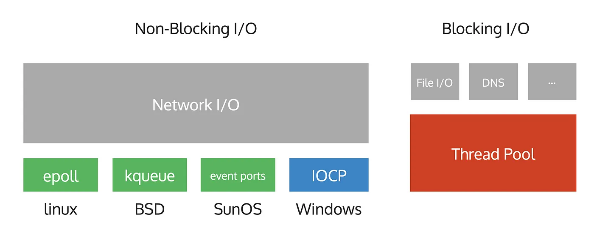

# Node.js Behind The Scenes

## What is Node.js?

Node.js is a JavaScript _single-threaded_ runtime built on Chrome’s V8 JavaScript engine. It uses an event-driven, non-blocking I/O model that makes it lightweight and efficient.

- one thread = one call stack / one event loop = one thing at a time

### Call Stack

The call stack is a data structure that records where in the program we are `FIFO`.

```javascript
function multiply(x, y) {
  return x * y;
}

function square(x) {
  return multiply(x, x);
}

function printSquare(x) {
  var s = square(x);
  console.log(s);
}

printSquare(5);
```

### Reactor Pattern

Node.js is written using the Reactor pattern, which provides an _event-driven model_ for handling I/O operations. When Node.js starts, it initializes the event loop, processes the provided input script (or drops into the REPL, which is not covered in this document) which may make async API calls, schedule timers, or call `process.nextTick()`, then begins processing the event loop.



## Node.js architecture:



The middle layer (Node.js) takes care of our JavaScript code and interacts it with the Operation System. Now let’s discuss the components of Node.js architecture.

### V8

This should be a well-known engine that parses and executes our JavaScript code.

### libuv

This is the library we previously discussed, which provides the EventLoop and most of the interactions needed to work with the operating system.

### Core modules

Node.js provides various native modules, such as fs, http, and crypto. Those are called native modules and include JavaScript source code.

### C++ bindings

In Node.js, we have an API that allows us to write C++ code, compile it, and require it in JavaScript as a module. These are called addons. Core modules may have their addons as well.

Node.js provides a compiler that generates addons, which essentially creates a `.node` file that can be required.

`require('./my-cpp-module.node');`

The _require_ function in Node.js prioritizes loading `.js` and `.json` files, followed by addon files with the `.node` type.

### c-ares, zlib, etc

There are also smaller libraries written in C/C++ that provide specific operations, such as file compression, DNS operations, and more.

## Event Queues

The EventLoop is a mechanism that continuously processes and handles events in a single thread until there are no more events to handle. The EventLoop consists of multiple queues, each with its priority level.



1. **Timers Queue:** handles callbacks scheduled by `setTimeout()` and `setInterval()`.
2. **I/O queue:** responsible for most of the asynchronous operations such as file system `fs` operations, `networking`, and more.
3. **Immediate queue:** responsible for `setImmediate()` calls. It allows us to schedule operations that should run after I/O operations.
4. **Close queue:** handles callbacks from close events like database and TCP connections (eg.`socket.on('close')`).

There are two types of tasks in the EventLoop: _Macrotasks_ and _Microtasks_.



**Macrotasks** are queued in the EventLoop and are processed in FIFO order. Each iteration of the EventLoop is called a _tick_. Each tick processes a single macrotask from the queue.

**Microtasks** are queued in the microtask queue and are processed after each macrotask. Each tick processes all microtasks in the queue before moving to the next macrotask.

## Microtasks & Macrotasks in practice

```javascript
const fs = require("fs");

fs.readFile(__filename, () => {
  console.log("1. readFile");

  process.nextTick(() => {
    console.log("2. nextTick in fs");
  });

  setTimeout(() => {
    console.log("6. setTimeout");

    process.nextTick(() => {
      console.log("7. nextTick in setTimeout");
    });
  }, 0);

  setImmediate(() => {
    console.log("3. setImmediate");

    process.nextTick(() => {
      console.log("4. nextTick in setImmediate");

      Promise.resolve().then(() => {
        console.log("5. Promise in setImmediate");
      });
    });
  });
});
```

Look at the final diagram of the EventLoop and try to guess the order of the logs.



1. **readFile** is queued in the I/O queue.
2. **nextTick in fs** is queued in the microtask queue.
3. **setImmediate** is queued in the check queue.
4. **nextTick in setImmediate** is queued in the microtask queue.
5. **Promise in setImmediate** is queued in the microtask queue.
6. **setTimeout** is queued in the timers queue.
7. **nextTick in setTimeout** is queued in the microtask queue.

## libuv

In OS, operations can be blocking or non-blocking. Blocking operations require a separate thread to enable concurrent execution of different operations.



Libuv allow us to work with the Network I/O asynchronously also provides a thread pool that allows us to execute blocking operations in separate threads. It also provides a mechanism to notify the main thread when the operation is completed.

## References

- [Node.js Event Loop](https://nodejs.org/en/docs/guides/event-loop-timers-and-nexttick/)
- [Node.js Behind The Scenes](https://www.udemy.com/course/node-js-behind-the-scene-arabic/)
- [You Don’t Know Node.js EventLoop](https://blog.bitsrc.io/you-dont-know-node-js-eventloop-8ee16831767)
- [What the heck is the event loop anyway? | Philip Roberts | JSConf EU](https://youtu.be/8aGhZQkoFbQ?si=bYqmhR9sr-lD83KN)
