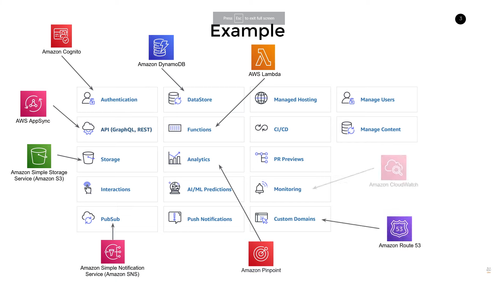

# AWS Amplify

AWS Amplify is a set of tools and services that can be used together or on their own, to help front-end web and mobile developers build scalable full stack applications, powered by AWS.

## What is AWS Amplify?

- _Glue_ service that helps you build _entire apps_ quickly
- Primarily used as a _CLI Tool_, but these is a limited feature UI
- Quickly add Storage, Authentication, Analytics, and more to your web or mobile app
- Behind the scenes, it's just CloudFormation

## Example



## Usage

- Admin UI
  - Limited features
  - Good for quick prototyping
- Primarily used as a CLI Tool

```bash
# Install
npm install -g @aws-amplify/cli

# Configure
amplify configure

# Initialize
amplify init

# Add features
amplify add auth
amplify add api
amplify add storage

# Push to AWS
amplify push

# Remove
amplify remove auth
amplify remove api
amplify remove storage
```

## Pros

- Quick to get started
- Good for prototyping
- Good for small projects
- Shields you form the complexity of AWS

## Cons

- You don't really _learn_ about _AWS_ services
- Collaboration can be frustrating
- Can't go _outside the box_
- Potential for surprise bills
