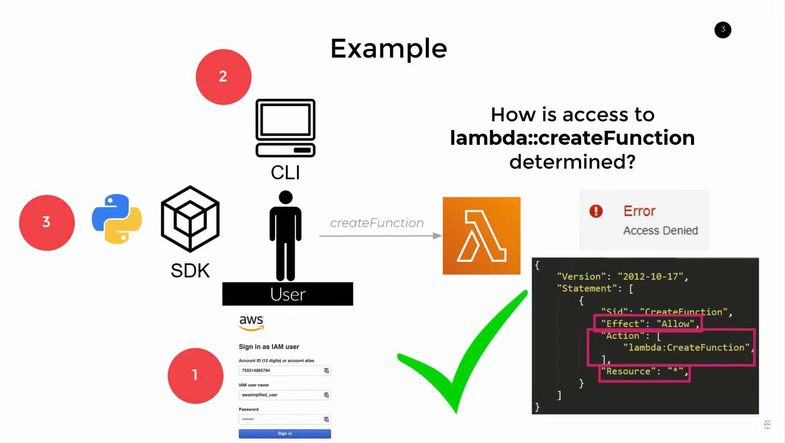

# AWS IAM

## What is IAM?

- IAM stands for Identity and Access Management
- Core AWS Service that helps you control access to AWS **resources**
- **Resources** are entities that you create and manage, i.e. EC2 instances, S3 buckets, RDS instances, etc.
- Users attempt to perform **Actions** on these resources, i.e. S3::GetObject, EC2::RunInstances, etc.
- Authorization to perform an **Action** depends on a **Policy** that is attached to the user.

## How it Works?

4 key concepts: **Users**, **Groups**, **Roles**, and **Policies**/**Permissions**

- **Users** specify individuals who can receive personal logins (i.e. access keys, secret access keys, and passwords)
- **Groups** are collections of users (i.e. Admins, Developers, etc.)
- **Roles** are used to delegate access to AWS resources to users, applications, or services that don't normally have access to them (i.e. EC2 instances, Lambda functions, etc.)
- **Policies** low level permissions to resources (Allow or Deny) (i.e. S3::GetObject, EC2::RunInstances, etc.) in JSON format

### Example



- User Alice wants to create a lambda function
- Alice is denied access because she does not have the required permissions
- Alice's permissions are defined in a policy
- The policy is attached to Alice's user account

## Access Keys and Secret Access Keys

- Access Keys are used to make programmatic calls to AWS API

## ReadOnly Access

- ReadOnly Access is a built-in policy that allows users to view resources but not modify them
  - i.e. DynamoDB table Read Only Access to Specific Columns
  ```json
  {
    "Version": "2012-10-17",
    "Statement": [
      {
        "Sid": "Stmt1234567890",
        "Effect": "Allow",
        "Action": [
          "dynamodb:GetItem*",
          "dynamodb:BatchGetItem",
          "dynamodb:Query",
          "dynamodb:Scan"
        ],
        "Resource": ["arn:aws:dynamodb:us-east-1:123456789012:table/MyTable"]
      },
      {
        "Sid": "Stmt1234567891",
        "Effect": "Allow",
        "Action": ["dynamodb:DescribeTable", "dynamodb:ListTables"],
        "Resource": ["*"]
      }
    ]
  }
  ```

## Other Important Concepts


- **Groups** are collections of users
- **Roles** are used to delegate access to AWS resources to users, applications, or services that don't normally have access to them
- **Trust Relationships** are used to define who can assume a role (i.e. which users, services, or applications)

## Pro Tips

- Protect your **Root Account** at all costs
- Explicit Effect _Deny_ overrides any _Allow_ statements
- User the Least Privilege Principle
- Use IAM Policy [Simulator](https://policysim.aws.amazon.com) to test your policies
