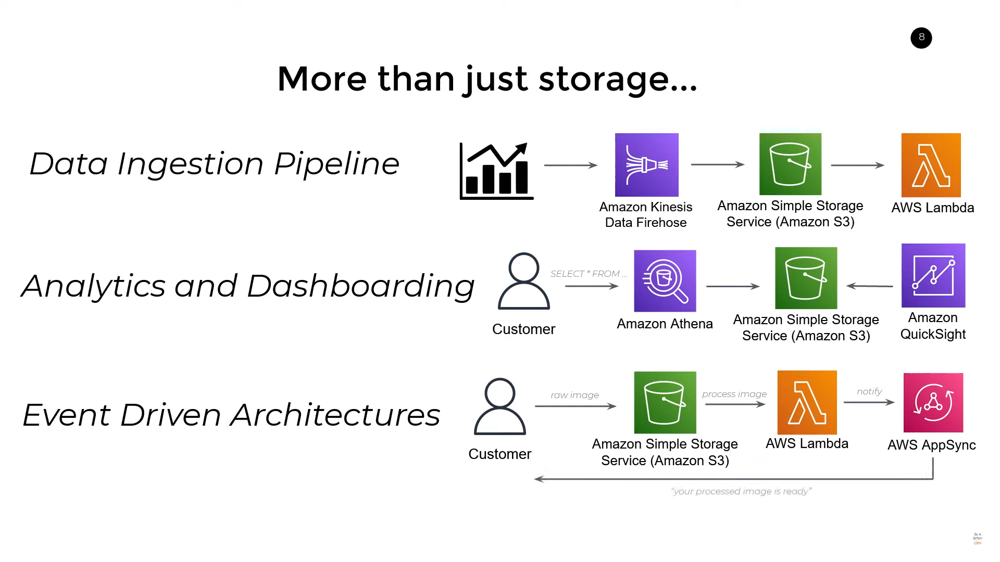

# AWS S3 (Simple Storage Service)

- S3 is a storage service offered by AWS - Launched in 2006
- Focused on **General Object Storage** on the Cloud
- Big files, small files, media content, source code, spreadsheets, etc.
- Scalable, Highly Available, Durable, Support integration with other AWS services
- Useful in a variety of scenarios:
  - Backup and Disaster Recovery
  - Website Hosting
  - Data Processing Pipelines

## Core Concepts

- **Buckets**: Containers for objects stored in S3
- **Objects**: Files stored in S3

You can access content in S3 via:

- _URL_: `https://s3.amazonaws.com/<bucket-name>/<object-key>`
- _Programmatic Access_: AWS SDKs

## S3 Storage Classes

- Storage classes allow you to reduce costs by storing data in different ways
- Examples: Standard, Intelligent Tiering, Infrequent Access, Glacier, etc.
- Each tier has different pricing, latency, and availability
- TIP: Use **Lifecycle Policies** to automatically move objects between tiers
  - Standard Tier (Hot Data) -> Infrequent Access Tier -> Glacier Tier (Cold Data)

## S3 Security

- Public access is blocked by
- Data Protection - High Availability, Durability, Encryption and at Rest
- Access - Access and resource policies based on AWS IAM
- Audit - Access logs, action based logs, alarms, etc.
- Infrastructure Security - Built on top of AWS Cloud Infrastructure (not exposed to the internet)

## S3 Features

- Data Ingestion Pipeline: Stock data -> Amazon Kinesis -> S3 -> AWS Lambda
- Analytics and Dashboard: Customer data -> Amazon Athena -> S3 <- Amazon QuickSight
- Event Driven Architecture: Customer data -> S3 -> AWS Lambda -> AWS AppSync

## S3 Pricing

- Depended on Storage Class, Storage Amount, Data Transfer, Requests, etc.
- Three main factors: **Storage**, **Requests** (GET, POST, etc), and Data **Transfer**
- [S3 Pricing](https://aws.amazon.com/s3/pricing/)
