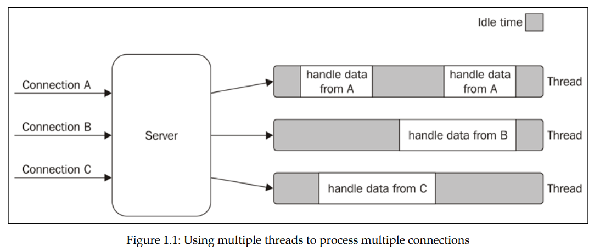
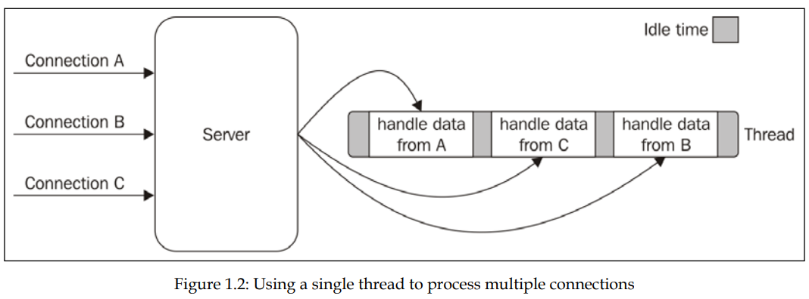
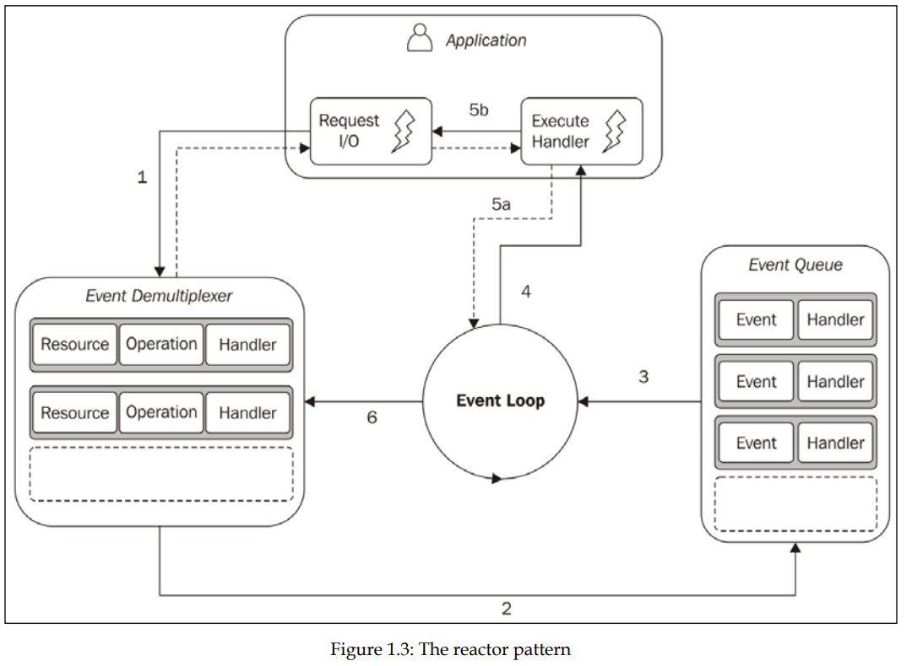
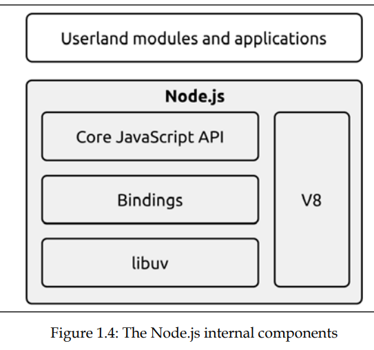

# Node.js Overview

Node.js is a popular JavaScript runtime that allows developers to build scalable network applications using an event-driven, non-blocking I/O model.

## The Node.js philosophy

_Philosophy_ is set of guiding principles that are generally accepted by the community, in context of Node.js, some of these principles come from node _creator_ Ryan Dahl, others from the Node.js _community_ and _JavaScript_ itself.

### Small Core

smallest possible set of functionalities, while leaving the rest to the so-called userland (or userspace), which is the ecosystem of modules living outside the core (e.g. npm registry) and maintained by the community.

### Small Modules

This principle has its roots in the _Unix_ philosophy, and particularly in two of its precepts, which are as follows:

- "Small is beautiful."
- "Make each program do one thing well."

Besides the clear advantage in terms of reusability, a small module is also:

- Easier to understand and use
- Simpler to test and maintain
- Small in size and perfect for use in the browser

Having smaller and more focused modules empowers everyone to share or reuse even the smallest piece of code; it's the Don't Repeat Yourself (DRY) principle applied at a whole new level.

### Small Surface area

Node.js modules is exposing a minimal set of functionalities to the outside world.

_TIP_ In practice, prefer to expose functions instead of classes, and being careful not to expose any internals to the outside world.

### Simplicity and pragmatism (KISS)

_"The design must be simple, both in implementation and interface. It is more important for the implementation to be simple than the interface. Simplicity is the most important consideration in a design."_ Richard P. Gabriel (The Rise of "Worse is Better")

The truth is that our software is always an approximation of reality.

## How Node.js works

Node event-driven, non-blocking I/O model based on the _reactor pattern_ and _libuv_.

### I/O is slow

reading/writing a file, a network connection, or a database is slower than executing a CPU-bound operation.

### Blocking I/O

when a thread is blocked, it can't do anything else. One way to overcome this limitation is to use multiple threads.

but this approach has its own problems, such as:

- **Complexity**: managing multiple threads is complex and error-prone.
- **Memory overhead**: each thread requires a certain amount of memory, and this can be a problem when dealing with a large number of connections.
- **Scalability**: the number of threads that can be created is limited by the operating system, and this can be a problem when dealing with a large number of connections.

### Non-blocking I/O

when a thread is not blocked, it can do other things. It uses _busy waiting_ to check if the I/O operation is completed, and this is not efficient.

### Event demultiplexing

Busy-waiting is definitely not an ideal technique for processing non-blocking resources, and this is where event demultiplexing comes into play. The basic idea is that the operating system is asked to be notified when a certain event occurs, and the rest of the time, the program is free to do other things.

### The reactor pattern

Handles I/O by blocking until new events are available from a set of observed resources, and then reacts by dispatching each event to an associated handler.

- **Libuv:** the I/O engine of Node.js that abstracts non-blocking I/O operations to a consistent interface across all supported platforms.

### The recipe for Node.js

The _reactor pattern_ and _libuv_ are the basic building blocks of Node.js, but we need three more components to build the full platform:

- **Bindings** responsible for wrapping and exposing libuv and other low-level functionalities to JavaScript.
- **V8** the JavaScript engine originally developed by Google for the Chrome browser.
- **Node.js APIs** JavaScript APIs that implements the high-level node functionality.

Node.js final architecture:

## JavaScript in Node.js

There is no DOM and no access to `document` or `window`, but we have access, Node.js has access to a set of services offered by the underlying operating system that are not available in the browser.

### Run the latest JavaScript with confidence

Node will have most recent version of V8.

_Note_ if we are developing a library meant to be used by third parties, our code may run on different versions of Node.js!.

### The module system

The original Node.js module system is called CommonJS, uses `require` keyword.

CommonJS was a necessary component for Node.js to allow developers to create large and better organized applications on a par with other server-side platforms.

### Full access to operating system services

Node.js to have bindings for all the major services offered by the underlying operating system.

### Running native code

- Node.js is certainly the possibility to create _userland_ modules that can bind to native code written in C/C++.
- With native code we can access low-level hardware ports (e.g., USB or serial)
- CPU-intensive applications, with a lot of data processing and manipulation, we can delegate the work to native code.
