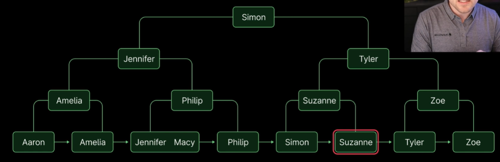

# Indexes

## Characteristics of Indexes

1. A separate data structure
2. A copy of (part of) the table data
3. A pointer to the original table data

## Rules of Indexes

1. Create as many as you need to optimize your queries
2. But as few as possible to save space and improve _write_ performance

## Create optimal indexes

- Data --> Schema (schema driven by the data)
- Queries --> Indexes (indexes driven by the queries)

## B+ Tree Indexes

B+ Tree is a data structure that is used to store indexes in MySQL.



## Primary Key Indexes

- A primary key is a column or a set of columns that uniquely identifies each row in the table (cluster index).
- Stick to _unsigned bigint_ over _UUID_ or _GUID_ as the primary key type (4 bytes vs 16 bytes).

## Secondary Indexes

- A secondary index is an index created on a column or a set of columns that are not the primary key.
- Every single leaf node of a secondary index contains a primary key appended (MySQL InnoDB).

## Primary Key data types

When choosing a data type for a primary key, you have several options:

- INT (4 bytes = 32 bits)
- BIGINT (8 bytes = 64 bits) - recommended
- UUID (16 bytes = 128 bits) - Universally Unique Identifier
- ULID (16 bytes = 128 bits) - Universally Unique Lexicographically Sortable Identifier
- GUID (16 bytes = 128 bits) - Globally Unique Identifier

The recommended data type for a primary key is UNSIGNED BIGINT with AUTO_INCREMENT.
This is because it is the most efficient in terms of storage and performance.

## Where to add indexes?

- Start with access pattern (queries).
- Add indexes to columns that are used in the WHERE clause.
- Also consider columns used in JOIN, GROUP BY, ORDER BY, etc.
- Avoid adding indexes to columns that are frequently updated.

## Index selectivity & cardinality

- The cardinality of an index is the number of unique values.
- The selectivity of an index is the number of unique rows compared to the total number of rows.
- The higher the selectivity, the more likely MySQL will use the index to retrieve data.

```sql
SHOW INDEX FROM table_name;

-- Cardinality
SELECT COUNT(DISTINCT column_name) FROM table_name;

-- Selectivity
SELECT COUNT(DISTINCT column_name) / COUNT(*) FROM table_name;
```

## Index prefix

- The prefix of an index is the number of bytes that MySQL uses to store the index.
- The prefix of an index is the number of characters if the column is a string.

```sql
ALTER TABLE table_name ADD INDEX index_name (column_name(length));
```

## Composite Indexes

- A composite index is an index on multiple columns.
- The order of columns in the composite index matters

### Rules for composite indexes

- **Left-to-right, no skipping**: MySQL can only access the index in order, starting from
  the leftmost column and moving to the right. It can't skip columns in the index.
- _Stops at the first range_: MySQL stops using the index after the first range condition encountered.

### Analyzing index usage

```sql
EXPLAIN SELECT * FROM people WHERE first_name = 'Aaron' AND last_name = 'Francis';

| id | select_type | table  | type | possible_keys | key   | key_len | ref         | rows | filtered |
|----|-------------|--------|------|---------------|-------|---------|-------------|------|----------|
|  1 | SIMPLE      | people | ref  | multi         | multi | 404     | const,const |    1 |   100.00 |
```

The EXPLAIN output shows that the multi index is being used, with a key length of 404 bytes. This indicates that MySQL is using both the first_name and last_name parts of the index.

If we add birthday to the mix, the key_len jumps to 407

```sql
EXPLAIN SELECT * FROM people WHERE first_name = 'Aaron' AND last_name = 'Francis' and birthday = '1989-02-14';

| id | select_type | table  | type | possible_keys | key   | key_len | ref               | rows | filtered |
|----|-------------|--------|------|---------------|-------|---------|-------------------|------|----------|
|  1 | SIMPLE      | people | ref  | multi         | multi | 407     | const,const,const |    1 |   100.00 |
```

However, if you change the query to include a range condition on last_name, then the key_len drops back down to 404.

```sql
EXPLAIN SELECT * FROM people WHERE first_name = 'Aaron' AND last_name < 'Francis' and birthday = '1989-02-14';

| id | select_type | table  | type  | possible_keys | key   | key_len | ref | rows | filtered |
|----|-------------|--------|-------|---------------|-------|---------|-----|------|----------|
|  1 | SIMPLE      | people | range | multi         | multi | 404     |     |   55 |    10.00 |
```

The key length remains 404 bytes, meaning MySQL stops using the index at the first range condition (last_name in this case) and doesn't use the birthday part of the index.

### Tips for composite indexes

1. Equality conditions that are commonly used would be good candidates for being first in a composite index.
2. Range conditions or less frequently used columns would be better candidates for ordering later in the composite index.

## Covering Indexes

- A covering index is an index that contains all the columns required to serve the query.
- MySQL can retrieve the data from the index without accessing the table data.

## Functional Indexes

- A functional index is an index that is created based on an expression.
- The expression can be a function that operates on one or more columns.

```sql
ALTER TABLE people ADD INDEX idx_month_birth ((MONTH(birthday)));
```

_Note_ MySQL creates a hidden column (derived) for the expression and stores the result of the expression in the hidden column.

## Indexing JSON Columns

- MySQL supports indexing JSON columns.
- The index is created on the JSON column and a specific JSON path expression.

### Method 1: generating a virtual column

```sql
 -- Create a virtual column
ALTER TABLE json_data ADD COLUMN email VARCHAR(255) GENERATED ALWAYS AS (`json` ->> '$.email');

-- Create an index on the virtual column
ALTER TABLE json_data ADD INDEX (email);
```

### Method 2: creating a functional index

```sql
ALTER TABLE json_data ADD INDEX ((
    CAST(`json`->>'$.email') AS CHAR(255)
  COLLATE utf8mb4_bin)
);
```

## Indexing for wildcard searches

If you have a query like this:

```sql
SELECT * FROM people WHERE email LIKE 'aaron%';
```

Simply add an index on the email column.

```sql
ALTER TABLE people ADD INDEX (email);
```

But if you have a specific words or phrases:

```sql
SELECT * FROM people WHERE email LIKE '%aaron%';
```

MySQL cannot use the index we created on the email column. This means the query will be slower than if we had used a wildcard character only at the end of the search string.

## Indexing for full-text searches

MySQL supports full-text search on InnoDB tables.

```sql
ALTER TABLE people ADD FULLTEXT INDEX `fulltext`(first_name, last_name, bio);
```

### Implementing full-text searches

1. Natural language mode

```sql
SELECT * FROM people
WHERE MATCH(first_name, last_name, bio) AGAINST('Aaron');
```

2. Boolean mode

Boolean mode allows you to use modifiers, like +, -, >, <, and parentheses in your search query.

```sql
SELECT * FROM people
WHERE MATCH(first_name, last_name, bio) AGAINST('+Aaron -Francis' IN BOOLEAN MODE);
```

You can sorting results by relevancy

```sql
SELECT * FROM people
WHERE MATCH(first_name, last_name, bio) AGAINST('+Aaron -Francis' IN BOOLEAN MODE)
ORDER BY MATCH(first_name, last_name, bio) AGAINST('+Aaron -Francis' IN BOOLEAN MODE) DESC;
```

## Invisible Indexes

How to make an index invisible

```sql
ALTER TABLE people ALTER INDEX email_idx INVISIBLE;
```

Benefits of making an index invisible: you can test the performance of queries without the index.

_Note_ If it has `unique` constraint, it will still be enforced.

## Foreign Key Indexes

- A foreign key is a column or a set of columns in a table that references to the primary key of another table.
- MySQL automatically creates an index on the foreign key column(s).

_Note_ Foreign keys can exist without constraints, but constraints are helpful to maintain referential integrity.

_Tip_ Move referential integrity checks to the application layer.
