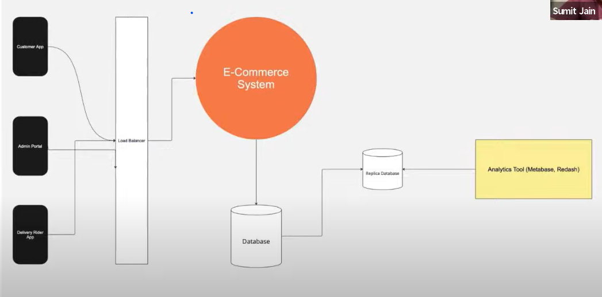
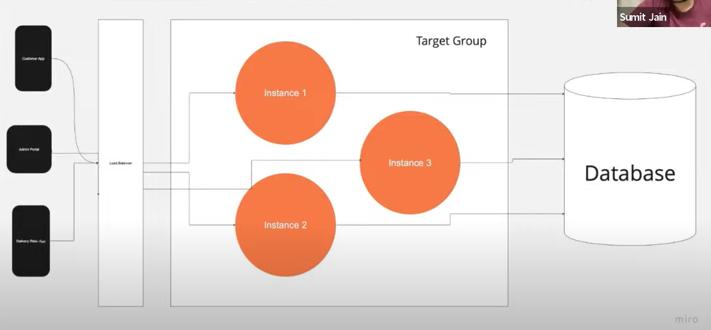
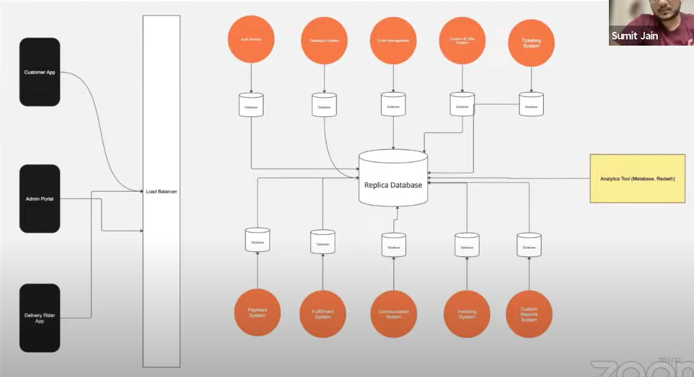
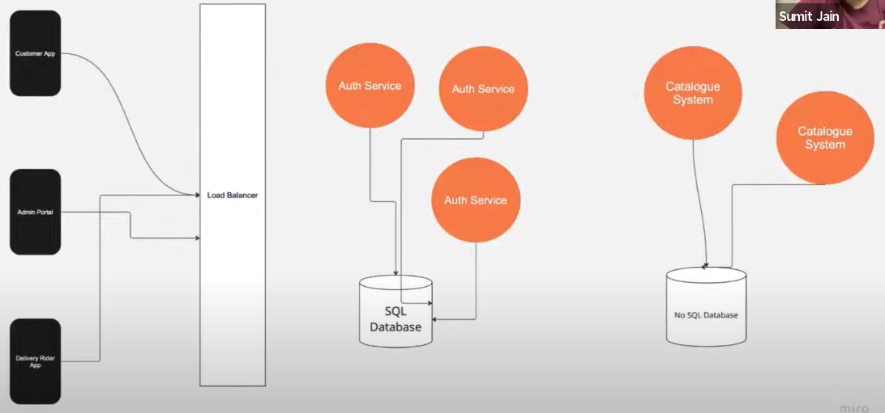
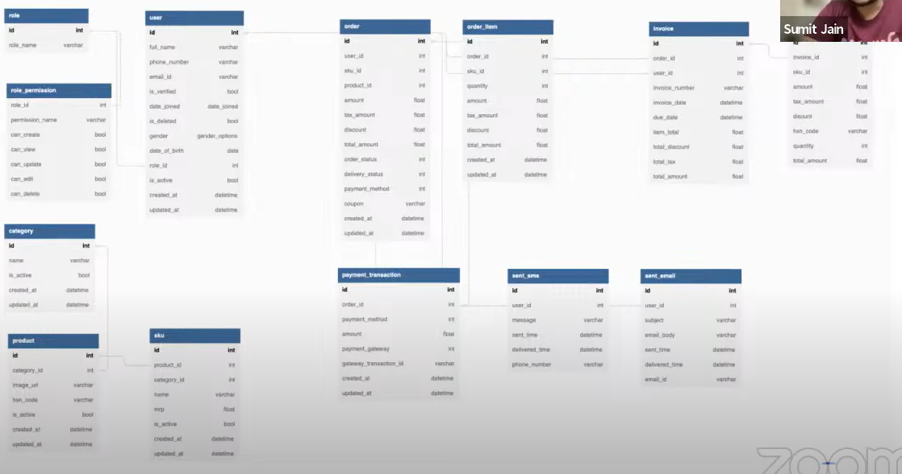

# System Design E-Commerce Platform

## Requirements/Key Components

### Functional Requirements

- Auth Service (RBAC)
- Catalog/Inventory Service
- Order Service
- Payment Service
- Invoicing Service
- Shipping Service
- Communication Service
- Analytics/Reporting Service
- Ticketing Service

### Non-Functional Requirements

- Availability
- Latency
- Scalability
- Observability (Logging, Monitoring, Alerting)

### Interface Requirements

- Customer App
- Admin Portal
- Delivery App

## High Level Workflow

## Monolith

You can use a monolith to start with, but you should be able to break it down into microservices later on. The monolith should be broken down into modules, and each module should be a microservice.

### Horizontal Scaling

- Add more instances of the same service
- Use a load balancer to distribute traffic between instances
- Use a shared cache to store session data

## Mini Monolith / True Microservices

- Each service has its own database
- Each service has its own API

## Horizontal vs Vertical Scaling

- Horizontal scaling is adding more instances of the same service
- Vertical scaling is adding more resources to the same instance

## DB Schema

## Non-Functional Requirements

### Availability

1. _Redundancy_: Have multiple instances of the same service (Horizontal Scaling)
2. _Load Balancing_: Distribute traffic between instances (Round Robin, Least Connections, etc.)
3. _Monitoring_: Monitor the health of each instance (CPU, Memory, Disk, Network, etc.)
4. _Disaster Recovery_: Have a backup of the database (Master-Slave, Master-Master, etc.)
5. _Capacity Planning_: Plan for future growth (Traffic, Storage, etc.)
6. _Regular Maintenance_: Keep the system up to date (OS, Libraries, etc.)

### Observability

1. _Logging_: Log all the requests and responses (ELK, Splunk, etc.)
2. _Monitoring_: Monitor the health of each instance (New Relic, DataDog, etc.)
3. _Alerting_: Send alerts when something goes wrong (Email, SMS, etc.)

### Security

1. _Authentication_: Verify the identity of the user (JWT, OAuth, etc.)
2. _Authorization_: Verify the permissions of the user (RBAC, ABAC, etc.)
3. _Encryption_: Encrypt data in transit and at rest (TLS, AES, etc.)
4. _Input Validation_: Validate all the inputs (SQL Injection, XSS, etc.)
5. _Audit Logging_: Log all the actions performed by the user (ELK, Splunk, etc.)

### Latency

1. _Caching_: Cache frequently accessed data (Redis, Memcached, etc.)
2. _CDN_: Cache static assets (CloudFront, Akamai, etc.)
3. _Minimize Network Round Trips_: Combine multiple requests into one (GraphQL, gRPC, etc.)
