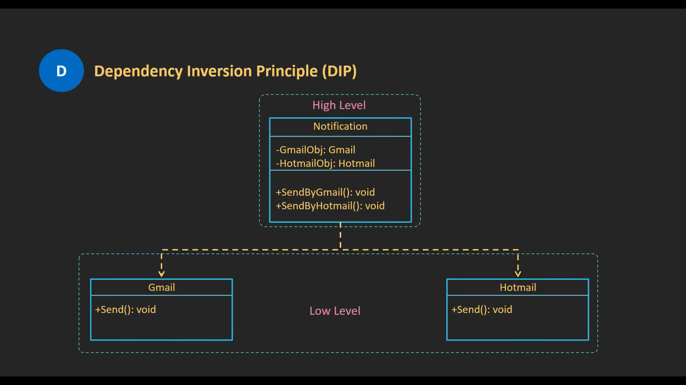

# Dependency Inversion Principle

Dependency Inversion Principle (DIP) state that high-level modules _should not_ depend upon low-level modules. Both should depend upon an abstraction.

As shown in the following diagram, the high-level module `Notification` depends (_tightly coupled_) on the low-level modules `Hotmail` and `Gmail`. This is a violation of the DIP.

The DIP is a way to decouple the high-level modules from the low-level modules. This is achieved by introducing an abstraction between the high-level and low-level modules. The high-level module depends on the abstraction, and the low-level module implements the abstraction.

## Conclusion

The DIP is a way to decouple the high-level modules from the low-level modules. This is achieved by introducing an abstraction between the high-level and low-level modules. The high-level module depends on the abstraction, and the low-level module implements the abstraction.
