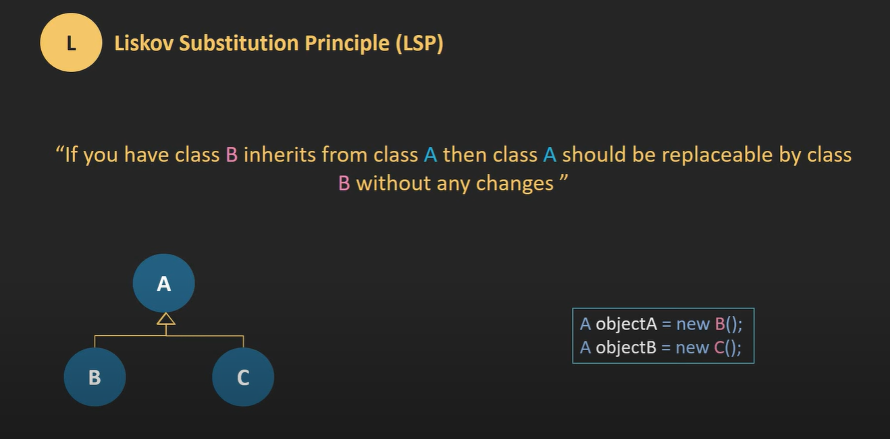

# Liskov Substitution Principle

The Liskov Substitution Principle (LSP) states that objects of a superclass shall be replaceable with objects of its subclasses without breaking the application. That requires the objects of your subclasses to behave in the same way as the objects of your superclass.

## Conclusion

The Liskov Substitution Principle is a fundamental principle in object-oriented programming. It is the "L" in the SOLID acronym. It is important to adhere to this principle to ensure that the objects of your subclasses behave in the same way as the objects of your superclass.
