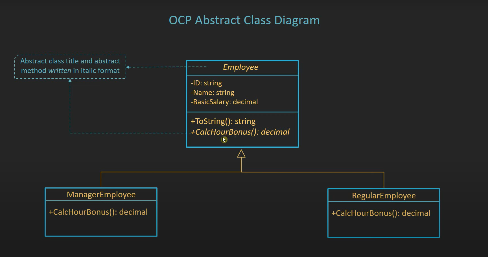
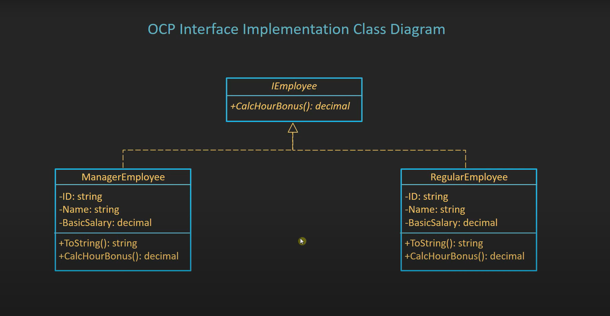

# Open-Closed Principle

The Open-Closed Principle (OCP) states that a software artifact should be open for extension but closed for modification. This means that a class should be easily extendable without modifying the class itself. This principle is the "O" in the SOLID acronym.

## How to implement the Open-Closed Principle

### 1. Abstraction

Use abstract class and add new functionality to the derived class.



```csharp
public abstract class Employee
{
    public string ID { get; set; }
    public string Name { get; set; }
    public decimal BasicSalary { get; set; }

    public decimal CalculateHoursBonus(decimal hours);

    public override string ToString()
    {
        return $"Employee Id: {ID}, Name: {Name}";
    }
}

public class ManagerEmployee : Employee
{
    public override decimal CalculateHoursBonus(decimal hours)
    {
        return (BasicSalary / 30 / 8) * hours * 2;
    }
}

public class RegularEmployee : Employee
{
    public override decimal CalculateHoursBonus(decimal hours)
    {
        return (BasicSalary / 30 / 8) * hours;
    }
}
```

### 2. Interface

Use interface and add new functionality to the derived class.



```csharp
public interface IEmployee
{
    decimal CalculateHoursBonus(decimal salary);
    string ToString();
}

public class ManagerEmployee : IEmployee
{
    public string ID { get; set; }
    public string Name { get; set; }
    public decimal BasicSalary { get; set; }

    public decimal CalculateHoursBonus(decimal )
    {
        return (BasicSalary / 30 / 8) * hours * 2;
    }

    public override string ToString()
    {
        return $"Employee Id: {ID}, Name: {Name}";
    }
}

public class RegularEmployee : IEmployee
{
    public string ID { get; set; }
    public string Name { get; set; }
    public decimal BasicSalary { get; set; }

    public decimal CalculateHoursBonus(decimal hours)
    {
        return (BasicSalary / 30 / 8) * hours;
    }

    public override string ToString()
    {
        return $"Employee Id: {ID}, Name: {Name}";
    }
}
```

## Conclusion

By following the Open-Closed Principle, you can create a more maintainable and scalable codebase. This principle encourages you to design your classes and modules in a way that allows for easy extension without modifying the existing code. This can lead to a more flexible and adaptable system, making it easier to accommodate new requirements and changes in the future.
