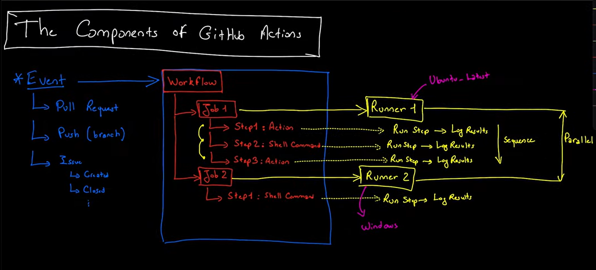

# GitHub Actions

**GitHub Actions** is a CI/CD tool that allows you to automate your software development workflows in the same place you store code and collaborate on pull requests and issues. <br> You can write individual tasks, called actions, and combine them to create a custom workflow.



**Events** are specific activity triggers that start a workflow. For example, activity triggers include opening a pull request, pushing to a branch, or releasing a new version of a repository.

**Workflows** are custom automated processes that you can set up in your repository to build, test, package, release, or deploy any code project on GitHub.

**Runners** run your jobs in a virtual environment. You can use GitHub-hosted runners or self-hosted runners.

**Jobs** are a set of steps that execute on the same runner. By default, jobs run in parallel.

**Actions** are individual tasks that you can combine to create jobs and customize your workflow.

**Steps** are individual tasks that can run commands or actions.

**Self-hosted runners** are custom runners that you can host in your own environment and can be physical, virtual, container, on-premises, or in a cloud.

**GitHub-hosted runners** are virtual machines that are hosted by GitHub and run in a clean environment.

## Example

The following example is a simple workflow that runs on every push to the repository. It checks out the repository code, lists the files in the repository, and prints the status of the job.

```yaml
name: GitHub Actions Demo
run-name: ${{ github.actor }} is testing out GitHub Actions 🚀
on: [push]
jobs:
  Explore-GitHub-Actions:
    runs-on: ubuntu-latest
    steps:
      - run: echo "🎉 The job was automatically triggered by a ${{ github.event_name }} event."
      - run: echo "🐧 This job is now running on a ${{ runner.os }} server hosted by GitHub!"
      - run: echo "🔎 The name of your branch is ${{ github.ref }} and your repository is ${{ github.repository }}."
      - name: Check out repository code
        uses: actions/checkout@v4
      - run: echo "💡 The ${{ github.repository }} repository has been cloned to the runner."
      - run: echo "🖥️ The workflow is now ready to test your code on the runner."
      - name: List files in the repository
        run: |
          ls ${{ github.workspace }}
      - run: echo "🍏 This job's status is ${{ job.status }}."
```
