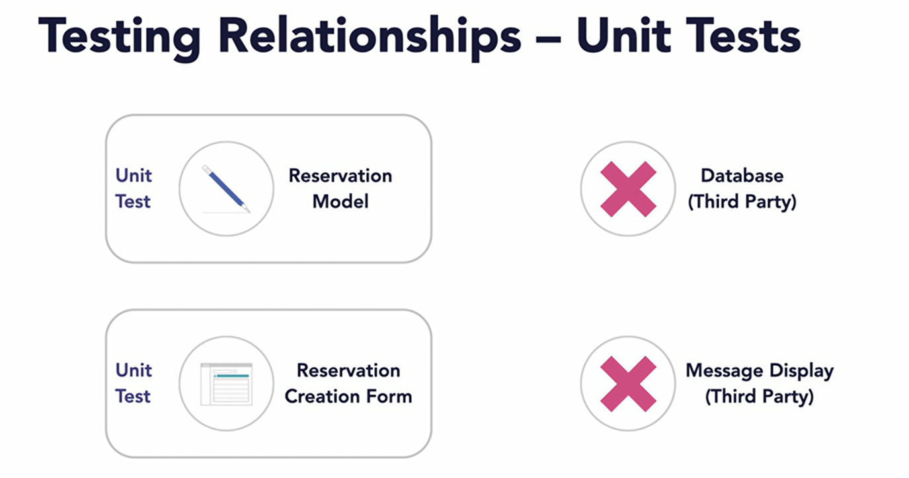
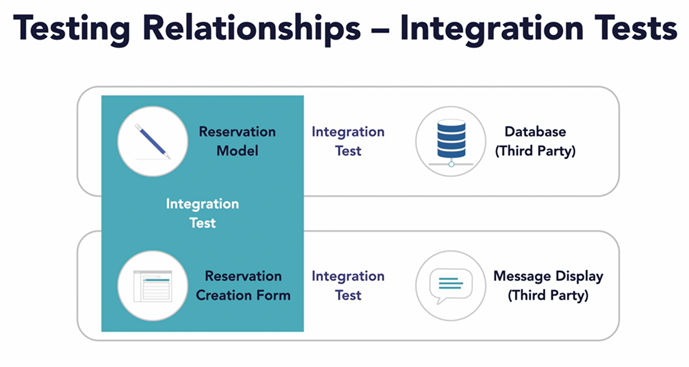

# Node.js: Testing and Code Quality

## What you will learn?

- Code quality definition
- Coding conventions and standards
- Creating and enforcing coding standards
- Unit, integration, functional, and system testing
- Testing frameworks
- Test specification interfaces
- Assertions for correctness

## What is code quality?

code quality is a measure of how well the code meets the _functional and  
non-functional requirements_ of the software. It is also a measure of how  
_maintainable_ the code is and how useful it is in _multiple places_.

## Code Standards and Enforcement

### Coding Conventions

Coding conventions set of guidelines for a language

- Programming style: Code readability
- Practices: how to build and architect software
- Methodologies: how to approach software development

### Coding Standards

- A collection of coding conventions
- Designed to produce quality code
- Formally specified and adopted by a team

### Enforcing Coding Standards

the process of ensuring that the code meets the standards set by the team.  
This can be done in several ways:

- Manual enforcement: Code reviews
- Linters: tools that analyze code for potential errors.
- Code formatters: tools that automatically format code to meet standards.

- [Google Style Guide](https://google.github.io/styleguide)
- [Editor Config](https://editorconfig.org/)
- [ESLint](https://eslint.org/)
- [Prettier](https://prettier.io/)

## Testing

Testing is the process of evaluating a system or its components with the intent  
to find whether it satisfies the specified requirements or not. Testing is  
executing a system in order to identify any gaps, errors, or missing requirements  
in contrary to the actual requirements.

### Types of Testing

- Unit testing: Smallest part of the system in isolation
- Integration testing: Combining different parts of the system
- Functional testing: Compare results to specifications
- System testing: Complete end-to-end testing
- Regression testing: testing to ensure that new code does not break existing code

## A Testing Frameworks

- Facilitates test automation
  - Runs tests
  - Reports results
- Provides a structure and tooling
- Delegates maintenance
  - Developers can focus on writing tests

## Node.js Testing Frameworks

- Mocha: Test runner
- Chai: Assertion library
- Jasmine: BDD framework
- Jest: Facebook's testing framework

How to organize tests in a project?

## Test Specification Interface

- Frameworks provide a way to write tests
- Use Domain Specific Language (DSL)
  - Test-Driven Development (TDD)
  - Behavior-Driven Development (BDD)
- TDD describes when and BDD describes how and why

## Assertions for Correctness

Asserts are used to verify that the code behaves as expected and to report  
errors if it does not. They are used to check the correctness of the code.

## Test Doubles

It is a generic term for any case where you replace a production object for testing purposes.

- **Dummy** objects are passed around but never actually used. Usually they are just used to  
  fill parameter lists.
- **Fake** objects actually have working implementations, but usually take some shortcut which  
  makes them not suitable for production (an InMemoryTestDatabase is a good example).
- **Stubs** provide canned answers to calls made during the test, usually not responding at all  
  to anything outside what's programmed in for the test.
- **Spies** are stubs that also record some information based on how they were called. One form  
  of this might be an email service that records how many messages it was sent.
- **Mocks** are pre-programmed with expectations which form a specification of the calls they are  
  expected to receive. They can throw an exception if they receive a call they don't expect and  
  are checked during verification to ensure they got all the calls they were expecting.

[Test Double - Martin Fowler](https://martinfowler.com/bliki/TestDouble.html)

## Test Coverage

Test coverage is a measure used to describe the degree to which the source code.
There are several types of coverage:

- Statement: Measures the number of statements executed (e.g., lines of code) [MDN Statements](https://developer.mozilla.org/en-US/docs/Web/JavaScript/Reference/Statements)
- Branch: Measures the number of branches executed (e.g., if statements)
- Function: Measures the number of functions executed (e.g., methods)
- Line: Measures the number of lines executed (e.g., lines of code)

## Summary

BDD scenarios the following patterns?

- Given: The initial state of the system
- When: An action is taken
- Then: The expected outcome

---

A chained assertion like “be” tests values and types. It is used to test the  
correctness of the code. It _does not throw an error_ if the test fails.

---

## Mock Objects vs Test Spies

- Mock objects are used to test the behavior of the code under test.
- Test spies are used to test the behavior of the code under test.
