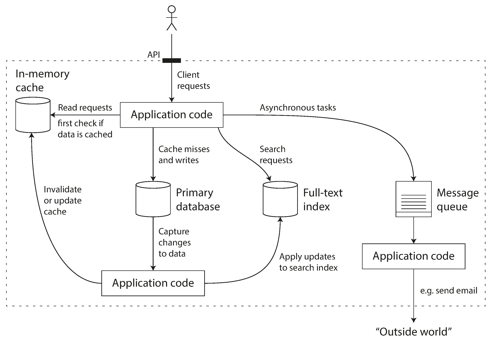

# Chapter 1. Reliable, Scalable, Maintainable Applications

- _data-intensive_ vs _compute-intensive_
- Types of _data systems_: database, cache, search index, stream processing, batch processing

## Thinking about data systems

 
Special-purpose data system from smaller, general-purpose components.

- How do you ensure that the data remains correct and complete, even when things go wrong internally?
- How do you provide consistently good performance to clients, even when parts of your system are degraded?
- How do you scale to handle an increase in load?
- What does a good API for the service look like?

## Reliability

Reliable: it can continue to work even when things go wrong.

_Fault_ vs _Failure_

- Fault: One component stops working as expected
- Failure: The software stops providing it service to the user

### Hardware Fault

- **Problem**: Faulty RAM, Hard Derive crashes, or Power outage in a datacenter
- **Solution**:
  1. Redundant hardware components (_hardware redundancy_)
  2. Software fault-tolerance techniques (_rolling upgrade_)

### Software Errors

- **Problem**: Systematic error within the system (Bug). It is hard to anticipate and could cause cascading failure
- **Solution**: Testing, process isolation, allowing processes to crash and restart,  
  measuring, monitoring, and analyzing system behavior in production

### Human Errors

- **Problem**: Humans are unreliable
- **Solution**:
  - Design a system that is minimize errors through abstractions, clean APIs, etc.
  - Sandbox environment with real data for testing
  - Test all levels, Unit, Integration, E2E
  - Allow easy recovery (rollback)
  - Monitoring (telemetry) for performance metrics and errors

## Scalability

### Describing Load

- **Load Parameters**: help determine how much the current system is scalable
  - requests per second in web applications
  - ratio for read to write in a database
  - simultaneously active users on a chat room
  - the hit rate on cache

### Describing Performance

**Throughput**: The number of records or requests a system can process per second. Think of it as the volume of water flowing through a pipe. 🚰

> In a batch processing system such as Hadoop, the number of records we can process per second, or the total time it takes to run a job on a dataset of a certain size.

**Response Time**: The total time between a client sending a request and receiving the full response. This includes the time spent processing the request and network delays.

**Latency**: Technically, this is the duration a request is waiting to be handled (lying dormant). However, it is often used interchangeably with response time to describe how "slow" a system feels.

**Percentile**: A statistical method to measure performance by ranking requests from fastest to slowest. For example, the 50th percentile (P50) is the median—half the requests are faster, half are slower.

**Tail Latencies**: The high percentiles (e.g., P95, P99, P99.9). These represent the slowest requests experienced by users, often the most important metric because these users suffer the most.

**Head-of-line Blocking**: When a slow request at the front of the queue forces faster requests behind it to wait, delaying everyone else. 🚦

**Percentiles in Practice** when several backend calls are needed to serve a request, it takes just a sin‐gle slow backend request to slow down the entire end-user request.

### Approaches for Coping with Load

1. Scaling up (vertical) or scaling out (horizontal)
2. Elasticity: automatically/manually adding computing resources when load increase
   - Easy for stateless systems
   - Hard for stateful systems

## Maintainability

**Maintainability** is the design goal of ensuring that many different people—including engineering and operations teams—can work on a system productively over time, even as requirements and technologies change.

This section breaks maintainability down into three core design principles: **Operability**, **Simplicity**, and **Evolvability**.

### 1. Operability: Making Life Easy for Operations

A good data system facilitates routine tasks, allowing the operations team to focus on high-value activities rather than fighting fires. Systems supports operability by providing:

- **Visibility:** Good monitoring to inspect runtime behavior and internals.
- **Automation:** Good support for integration with standard tools.
- **Independence:** Avoiding dependency on single machines so they can be taken down for maintenance without system-wide interruption.
- **Predictability:** Exhibiting predictable behavior to minimize operational surprises.
- **Documentation:** Providing a clear operational model.

### 2. Simplicity: Managing Complexity

When systems become a "big ball of mud" maintenance becomes difficult, budgets are overrun, and the risk of introducing bugs increases. To achieve simplicity, engineers must remove **accidental complexity**—complexity that is not inherent to the problem being solved but arises from the implementation itself.

- **Abstraction:** One of the best tools for removing accidental complexity is abstraction. A good abstraction hides implementation details behind a clean façade, allowing reuse and higher-quality software.

### 3. Evolvability: Making Change Easy

Evolvability (also known as extensibility, modifiability, or plasticity) is the ease with which engineers can adapt the system to changing requirements.

System requirements inevitably change due to new facts, business priorities, legal regulations, or growth. Evolvability is closely linked to _simplicity_: simple, easy-to-understand systems are easier to modify than complex ones.

- **Agility:** While Agile patterns provide a framework for adapting to change in source code, this book focuses on applying these principles to larger data systems to increase agility on an architectural level.
