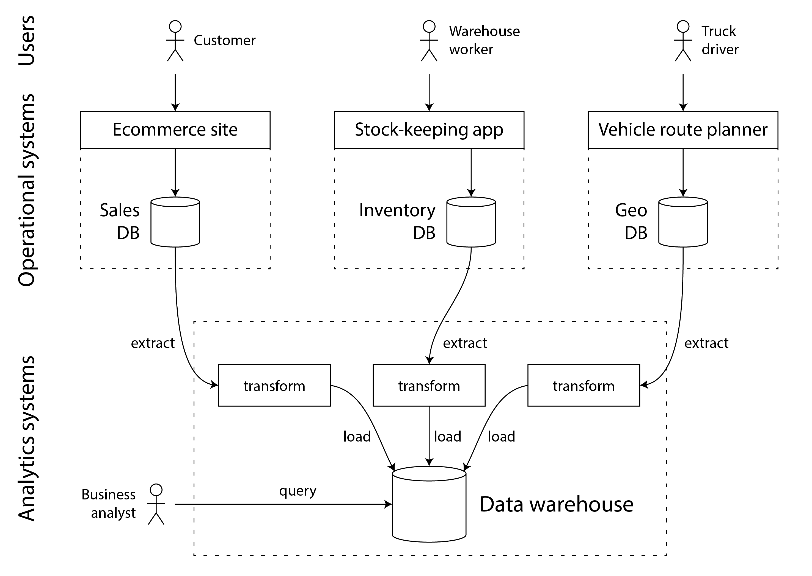
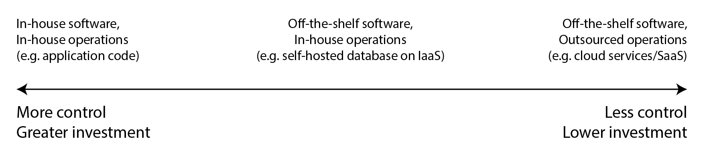

# Chapter 1. Trade-offs in Data Systems Architecture

## Operational vs Analytical Systems

- **Operational systems (OLTP)** consist of the backend services and data infrastructure where data is created, for example by serving external users. Here, the application code both reads and modifies the data in its databases, based on the actions performed by the users.
- **Analytical systems (OLAP)** serve the needs of business analysts and data scientists. They contain a read-only copy of the data from the operational systems, and they are optimized for the types of data processing that are needed for analytics.

> Outputs of analytics systems are made available to operational systems. For example, a machine-learning model generate recommendations for end-users, such as “people who bought X also bought Y”. Machine learning models can be deployed to operational systems using specialized tools such as TFX, Kubeflow, or MLflow.

### Characterizing Transaction Processing and Analytics

| Property            | Operational systems (OLTP)                      | Analytical systems (OLAP)                 |
| ------------------- | ----------------------------------------------- | ----------------------------------------- |
| Main read pattern   | Point queries (fetch individual records by key) | Aggregate over large number of records    |
| Main write pattern  | Create, update, and delete individual records   | Bulk import (ETL) or event stream         |
| Human user example  | End user of web/mobile application              | Internal analyst, for decision support    |
| Machine use example | Checking if an action is authorized             | Detecting fraud/abuse patterns            |
| Type of queries     | Fixed set of queries, predefined by application | Analyst can make arbitrary queries        |
| Data represents     | Latest state of data (current point in time)    | History of events that happened over time |
| Dataset size        | Gigabytes to terabytes                          | Terabytes to petabytes                    |

### Data Warehousing

Analytical challenges with OLTP systems

- Data is in multiple operational places (_data silos_)
- Schema for OLTPs is not flexible for analytics
- Analytical queries are expensive

#### Data Warehousing (Business Analysts)

- The data warehouse contains a read-only copy of the data in all the various OLTP systems in the company
- Data is extracted from OLTP databases (using either a periodic data dump or a continuous stream of updates)
- Transformed into an analysis-friendly schema, cleaned up, and then loaded into the data warehouse _Extract–Transform–Load_ (ETL)
  
- Data warehouse often uses a relational data model (SQL), perhaps using specialized business intelligence software

- External (3rd-party) data. ETL often implemented by specialist data connector services such as Fivetran, Singer, or AirByte
- Some database systems offer _hybrid transactional/analytic processing_ (HTAP), enables OLTP and analytics in a single system
- HTAP systems internally consist of an OLTP system coupled with a separate analytical system, hidden behind a common interface

#### Data Lake (Data Scientists)

- Centralized data repository that holds a copy of any data that might be useful for analysis
- Data lake simply contains files (text, images, videos, sensor readings, sparse matrices, feature vectors, genome sequences, etc.)
- Files in a data lake might be collections of database records, encoded using a file format such as Avro or Parquet
- This approach has the advantage that each consumer of the data can transform it to their needs _sushi principle_ “raw data is better”
- ETL processes have been generalized to data pipelines, the data lake has become an intermediate stop from the operational systems to the data warehouse

### Systems of Record and Derived Data

- A **Systems of record**, also known as _source of truth_, holds the authoritative or canonical version of some data. Each fact is represented exactly once _normalization_.
- **Derived data systems** Data in a derived system is the result of taking some existing data from another system and transforming or processing it in some way. _Denormalized_ values, indexes, materialized views, transformed data representations, and models trained on a dataset also fall into this category.

## Cloud vs Self-hosting

Things that are a core competency or a competitive advantage of your organization should be done in-house,  
whereas things that are non-core, routine, or commonplace should be left to a vendor.

### Pros and Cons of Cloud Services

### Cloud-Native System Architecture

- Layering of cloud services

- Separation of storage and compute

### Operations in the Cloud Era

## Distributed vs Single-Node Systems

## Data Systems, Law, and Society
